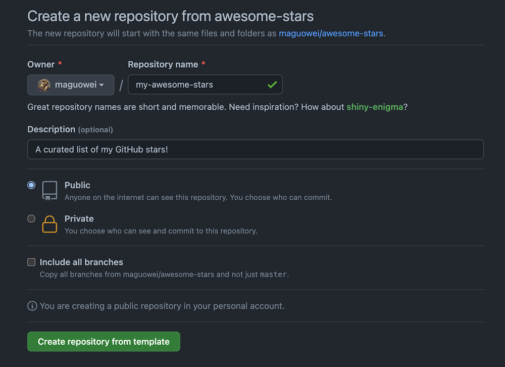
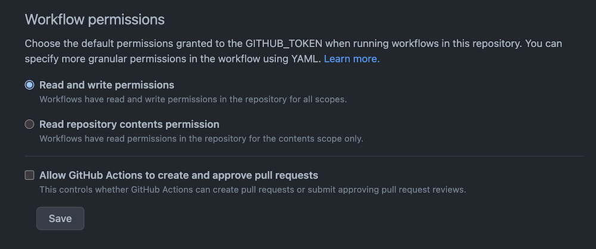
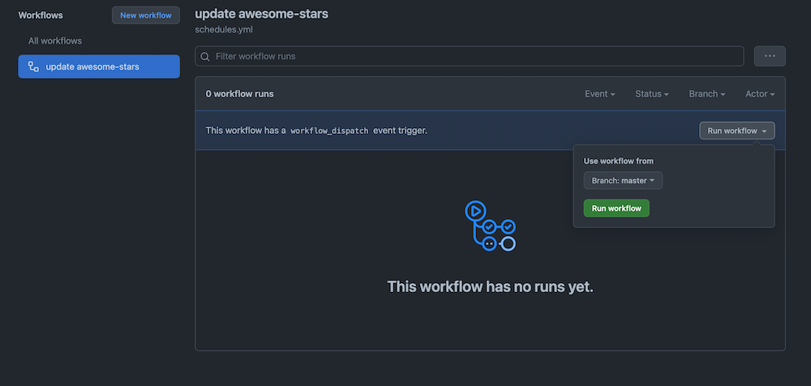
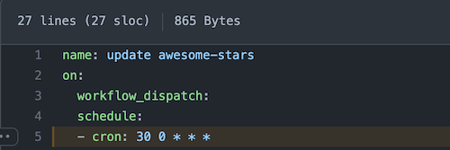

# Starred

[](https://github.com/ntk148v/starred/actions/workflows/ci.yml)
[](https://github.com/ntk148v/starred/actions/workflows/deploy.yml)

## Install

```bash

$ pip install git+https://github.com/ntk148v/starred.git
$ starred --username ntk148v --token=xxxxxxx --sort > README.md
```

## Usage

```bash
$ starred --help

$ starred --help

Usage: starred [OPTIONS]

  GitHub starred

  creating your own Awesome List by GitHub stars!

    example:     starred --username ntk148v --sort > README.md

Options:
    --username TEXT        GitHub username
    --token TEXT           GitHub token
    --sort                 sort by language
    --topic                category by topic, default is category by language
                        [default: False]
    --topic_limit INTEGER  topic stargazer_count gt number, set bigger to reduce
                          topics number  [default: 500]
    --repository TEXT      repository name
    --filename TEXT        file name  [default: README.md]
    --message TEXT         commit message  [default: update stars]
    --private              include private repos  [default: False]
    --format [table|list]  output repository information format. Table by default.
    --version              Show the version and exit.\
    --help                 Show this message and exit.
```

## Demo

```bash
# automatically create the repository
$ export GITHUB_TOKEN=yourtoken
$ starred --username yourname --repository awesome-stars --sort
```

- [`ntk148v/awesome-stars`](https://github.com/ntk148v/awesome-stars)
- [update awesome-stars every day by GitHub Action](https://github.com/ntk148v/awesome-stars/blob/master/.github/workflows/schedules.yml) the example with GitHub Action

### Who uses starred?

- by search: https://github.com/search?p=1&q=%22Generated+by+starred%22&type=Code
- by topics:
  - https://github.com/topics/starred
  - https://github.com/topics/awesome-stars

## Use [awesome-stars](https://github.com/ntk148v/awesome-stars) as template

The simple way to create an awesome-stars repository is to use [ntk148v/awesome-stars](https://github.com/ntk148v/awesome-stars/generate) as template.
It will auto update your awesome-stars repository every day by GitHub Action.

1. Click [Create a new repository from awesome-stars](https://github.com/ntk148v/awesome-stars/generate)



2. [Setting the permissions of the GITHUB_TOKEN for your repository](https://docs.github.com/en/repositories/managing-your-repositorys-settings-and-features/enabling-features-for-your-repository/managing-github-actions-settings-for-a-repository#setting-the-permissions-of-the-github_token-for-your-repository)

set permissions to `Read and write permissions` and click `Save` button



3. Run the workflow first time

click `Run workflow` button



4. Customize the workflow schedule

- [.github/workflows/schedules.yml#L5](https://github.com/ntk148v/awesome-stars/blob/master/.github/workflows/schedules.yml#L5)



## FAQ

1. Generate new token

   link: [Github Personal access tokens](https://github.com/settings/tokens)

2. Why do I need a token?

   - For unauthenticated requests, the rate limit is 60 requests per
     hour.
     see [Github Api Rate
     Limiting](https://developer.github.com/v3/#rate-limiting)
   - The token must be passed together when you want to automatically
     create the repository.

3. Install the master branch version

   ```bash
   $ poetry build
   $ pip install -e git+https://github.com/ntk148v/starred#egg=starred
   ```

4. Dev & RUN

   ```bash
   poetry run starred --help
   ```
